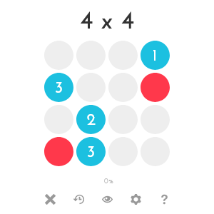
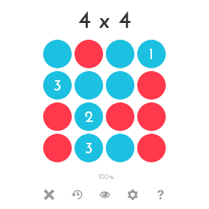

# 1. Überblick

0h n0 ist ein einfaches Computerspiel, das vergleichbar mit einem Mix aus Minesweeper und Sudoku ist, bei dem der Spieler mithilfe logischen Denkens das Spielfeld mit blauen und roten Steinen füllen muss.
Dabei muss eine gültige Steinkonfiguration folgende 3 einfache Regeln erfüllen. Es soll eine eindeutige Lösung geben.

1. Blaue Steine können andere blaue Steine in ihrer Reihe und Spalte sehen. Rote Steine blockieren ihre Sicht.
2. Blaue Steine haben eine Zahl auf ihnen, die vorgibt wie viele andere blaue Steine dieser Punkt sehen soll.
3. Jeder blauer Stein muss mindestens einen anderen blauen Stein sehen.

Ein Beispiel für den Anfang eines Spiels ist folgendes Spielfeld:

Das gelöste Spielfeld sieht dann so aus:

Ein Spielfeld auf schwierigstem Schwierigkeitsgrad könnte beispielsweise so aussehen:

Das Spiel ist online spielbar unter [0hn0.com](https://0hn0.com/). Dort ist auch ein visuelles Tutorial unter "How to play" zu finden.

# 2. Projekt: Ziele und Anforderungen

In diesem Projekt sollen Sie das Spiel basierend auf JavaFX implementieren. Für eine erfolgreiche Bearbeitung des Projekts und somit auch eine erfolgreiche Teilnahme an der zweiten Phase müssen Sie folgende Anteile der Punkte erreichen:
  - 50% der Punkte für die Implementierung.
  - 50% der Punkte für die Softwaredokumentation.
  - 65% der Punkte für die wöchentlichen Prästationen (Code) und Git-Upload.
  - 50% der Punkte für die Abschlusspräsentation.

## 2.1 Implementierung (270 Punkte: 50+90+90+40)

 \*\*\* _Sie dürfen im Rahmen dieses Projekt alle nötigen Technologien verwenden, die Sie in der ersten Phase des Praktikums kennengelernt haben. Möchten Sie sonst andere Technologien verwenden, sprechen Sie uns gerne darauf an._ \*\*\*

### 2.1.1 Benutzeroberfläche (50 Punkte)

  - **Grundgerüst:** Beim Start des Programms soll ein Fenster geöffnet werden. Das Fenster beinhaltet eine Gitterstruktur zur Repräsentation der einzelnen Felder. Das Gitter soll eine Größe von 4∗4 Zellen haben. Nutzen Sie zur Speicherung des Status der Zellen eine passende Datenstruktur. Ein lösbares Spielbrett soll mit Ankersteinen angezeigt werden. (15 P)

  - **Spielfeldgenerierung:** Die Generierung der Ankersteine soll eine eindeutige Lösung des Spielfeldes implizieren. (15 P)

  - **Menüleiste:** Fügen Sie dem Fenster eine Menüleiste hinzu mit einem Dropdown-Menü. Das Dropdown-Menü soll einen Button zum Beenden des Programms enthalten. In den folgenden Aufgaben werden noch weitere Menüpunkte folgen. (10 P)

  - **Erweiterung der Oberfläche:** Fügen Sie dem Fenster eine Anzeige hinzu, die die aktuelle Spielzeit in Sekunden anzeigt. Außerdem soll es einen Button zum Neustart des Spieles (mit der aktuellen Schwierigkeit) geben. Zusätzlich soll eine die Prozentzahl der gesetzten Steine angezeigt werden (Ankersteine ausgelassen). (10 P)

### 2.1.2 Spielablauf  (90 Punkte)

  - **Linksklick:** Mit dem Auswählen einer Zelle mit der linken Maustaste werden leere und rote Zelle zu blauen Zellen und bereits blaue Zellen zu leeren Zellen abgeändert. Zellen mit Ankersteinen dürfen nicht verändert werden. (15 P)

  - **Rechtsclick:** Mit dem Auswählen einer Zelle mit der rechten Maustaste werden leere und blaue Zelle zu roten Zellen und bereits rote Zellen zu leeren Zellen abgeändert. Zellen mit Ankersteinen dürfen nicht verändert werden. (15 P)

  - **Sieg:** Ein Spiel ist gewonnen, falls das komplette Spielfeld ausgefüllt ist und dabei keine der obig aufgeführten Spielregeln gebrochen wird. (30 P)

  - **Nicht-Sieg:** Ist ein Spielfeld komplett ausgefüllt, aber die Steinkonfiguration bricht eine oder mehrere Spielregeln, so soll dem Nutzer angezeigt werden, wo und warum dies eine ungültige Steinkonfiguration ist. (30 P)

### 2.1.3 Benutzerdefinierte Schwierigkeit (90 Punkte)

  - **Benutzerdefinierte Schwierigkeit:** Fügen Sie dem Dropdown-Menü einen Button hinzu, der ein neues Fenster öffnet, in dem man die Schwierigkeit des Spiels anpassen kann. Der Nutzer soll durch einen Slider die Dimension des Spielfeldes (4x4 bis 9x9) auswählen können, sowie die durch ein Dropdown-Menü die Schwierigkeit (Leicht, Mittel, Schwer), welche grob bestimmt wieviele Ankersteine generiert werden. (30 P)

  - **Serialisierung der Schwierigkeitszustände:** Wie auch den Spielstand sollen die aktuellen Schwierigkeitseinstellungen gespeichert werden können. Diese sollen auch in einem extra Ordner gespeichert werden. Existiert dieser nicht, soll er angelegt werden. Fügen Sie dem Dropdown-Menü einen entsprechenden Button hinzu. (30 P)

  - **Deserialisierung der Schwierigkeitszustände:** Es soll möglich sein die gespeicherten Schwierigkeitszustände zu laden. Die geladenen Schwierigkeitszustände sollen die aktuellen  ersetzen. Der Nutzer soll auswählen können welche Schwierigkeit er laden möchte. Fügen Sie dem Dropdown-Menü einen entsprechenden Button hinzu. (30 P)

### 2.1.4 Spielstände (40 Punkte)

  - **Serialisierung des Spielstandes:** Der aktuelle Zustand des Spieles soll gespeichert werden können. Fügen Sie einen entsprechenden Button dem Dropdown-Menü hinzu. Dabei soll eine JSON-Datei generiert werden, die den Zustand des Spieles enthält. Die Datei soll in einem extra Ordner für gespeicherte Zustande abgelegt werden. Existiert der Ordner noch nicht, soll dieser angelegt werden. Achten Sie darauf, dass Sie keine existierenden gespeicherten Zustände überschreiben. (20 P)

  - **Deserialisierung des Spielstandes:** Es soll ein gespeicherter Spielstand geladen werden können. Dabei soll der Nutzer auswählen können welchen der gespeicherten Spielstände er öffnen möchte. Fügen Sie dem Dropdown-Menü einen entsprechenden Button hinzu. (20 P)

## 2.2 Softwaredokumentation (60 Punkte)

Beachten Sie bitte, dass Ihre Dokumentation folgende Teile umfasst:

 - ### 2.2.1 Benuzterdokumentation

  Die Benuzterdokumentation soll alle Informationen enthalten, die für die Benutzung Ihresentwickelten Systems erforderlich sind. Neben der Beschreibung des Systems bezüglich dessen Zwecks, deren Funktionalität und Einsatz möglichkeiten, soll die Benutzerdokumentation zusätzlich die Installationsdokumentation beinhalten. Es soll daher die notwendige Hardware, Software, Standardbibliotheken und Laufzeitsysteme gelistet werden, sowie eine Beschreibung des Installationsprozesses.

 - ### 2.2.2 Systemdokumentation

  Die Systemdokumentation soll alle Informationen zur Struktur und Implementierungsdetails Ihrer Software enthalten, um eine Einarbeitung in das System zu vereinfachen und dessen Weiterentwicklung zu unterstützen. Die Systemdokumentation soll daher sowohl einen Überblick über den Aufbau des Systems beinhalten als auch eine detaillierte Beschreibung wichtiger Bestandteile Ihres Softwaresystems. Betrachten Sie bitte deshalb folgende Punkte bei Ihrer Dokumentation:

  - Beschreibung der Softwarestruktur und der einzelnen Bestandteile.
  - Beschreibung der verwendeten Tools, Frameworks und Klassenbibliotheken.
  - Beschreibung des Quelltextes mit Javadoc.
  - Beschreibung der verwendeten Daten und Datenstrukturen.
  - (Optional) Beschreibung der ausgeführten Testfälle (Testdokumentation).

 - ### 2.2.3 Projektdokumentation

  Die Projektdokumentation soll insbesondere die Organisationsplanung Ihres Projekts enthalten. Es sollen Teilaufgaben bzw. die Entwicklungsphasen des Projekts sowie  die  Zuteilung  der einzelnen Gruppenmitglieder bzgl. der entwickelten Teile beschrieben und präzise dokumentiert werden. Betrachten Sie bitte, dass die Bewertung des Projekts und der Präsentation der einzelnen Gruppenmitglieder insbesondere von diesem Teil der Dokumentation abhängt.

## 2.3 Git-Upload & Wöchentliche Präsentation (100 Punkte = 4 x 25P)

Die Praktikumsgruppen treffen sich weiter im Laufe der zweiten Phase einmal pro Woche mit ihrem Tutor um Fortschritte der Abschlussprojekte zu besprechen.

  - Jedes Gruppenmitglied muss **wöchentlich** seine Implementierungen bzw. Äderungen in das Git-Repository (Projektrepository) hochladen.

  - Jedes Gruppenmitglied muss **wöchentlich** seine Implementierungen bzw. Änderungen präsentieren.

## 2.4 Abgabe des Projekts und Abschlusspräsentation (60 P)

  - Das Projekt (Software + Dokumentation) soll bis spätestens 25.07.2021 abgegeben werden.
  - Die Abschlusspräsentation findet in der Kalenderwoche 30 (26.07 bis 30.07) statt.
  - Die Software soll von allen Gruppenmitglieder (Anwesenheit erforderlich) präsentiert werden.
